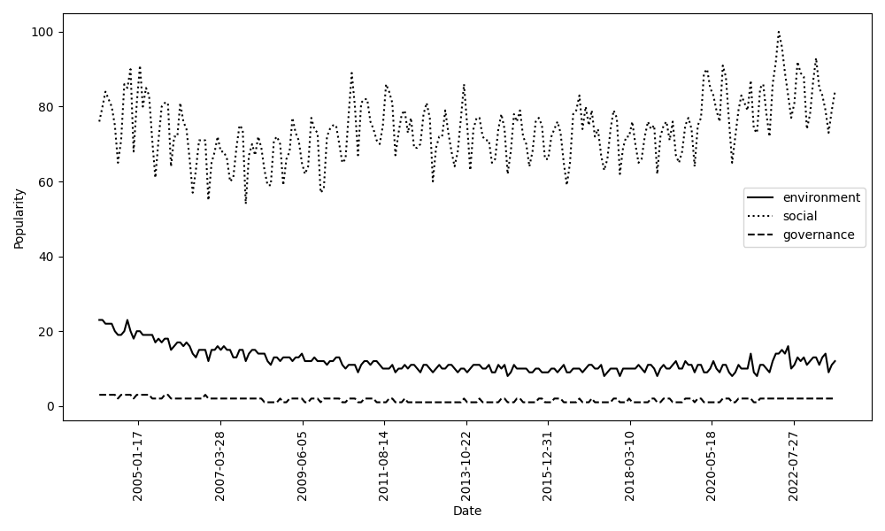

# GoogleTrends
Takefuji, Y. Enhancing ESG Practices in Lithium Battery Recycling: A Review of Current Policies and Proposed Solutions. Mater Circ Econ 6, 51 (2024). https://doi.org/10.1007/s42824-024-00146-5

Access to Google Trends: https://trends.google.com/trends/explore?date=now%201-d&q=ESG,governance&hl=en

You can create a csv file to plot graphs.

